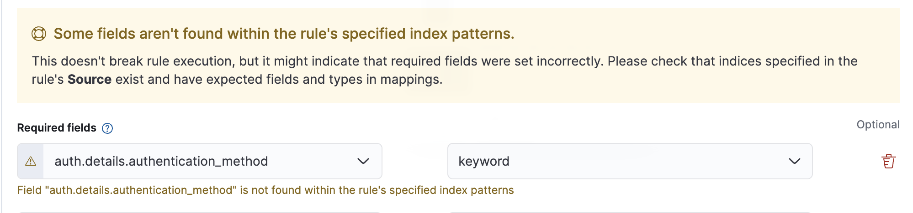

# Flattened Field Demo

Reproduces the "Unknown field" warning in Kibana's Security Detection Engine when a rule's Required Field points to a sub-key of a `flattened` mapped field.

## Background

This was discovered while investigating a customer case where the prebuilt rule **"Entra ID User Sign-in with Unusual Authentication Type"** showed `azure.signinlogs.properties.authentication_details.authentication_method` as **Unknown** in the rule editor.

Root cause: the Entra ID integration maps `authentication_details` as `flattened` type. Sub-keys of a `flattened` field are queryable at runtime but not registered in the index mapping — so Kibana's field resolver can never find them.

## What this demo shows

- An index `demo-flattened-auth` with `auth.details` mapped as `flattened`
- Sample documents with `auth.details.authentication_method` in the data
- A detection rule with `auth.details.authentication_method` as a Required Field
- The resulting warning: `Field "auth.details.authentication_method" is not found within the rule's specified index patterns`

## Stack

| Component     | Version | Port  |
|---------------|---------|-------|
| Elasticsearch | 8.18.3  | 9250  |
| Kibana        | 8.18.3  | 5650  |

Credentials: `elastic` / `changeme`

## Usage

```bash
# Start the stack
./start.sh

# Create index, documents, DataView, and detection rule
./setup.sh

# Tear down
./teardown.sh
```

After running `setup.sh`, open the URL printed at the end and click **Edit rule settings** to see the warning.



## Key mapping

```json
"auth": {
  "properties": {
    "requirement": { "type": "keyword" },
    "details":     { "type": "flattened" }
  }
}
```

`auth.details.authentication_method` exists in the data and is queryable — but because `details` is `flattened`, the sub-key is never registered in the mapping. Kibana's Required Fields component checks field names against the index mapping, so the field always shows as Unknown.

## Related

- Customer case: 02064936
- Kibana source: [required_fields.tsx#L127](https://github.com/elastic/kibana/blob/5fedf4c29ebd968d546825d123db26d63c209551/x-pack/solutions/security/plugins/security_solution/public/detection_engine/rule_creation/components/required_fields/required_fields.tsx#L127)
- Beats test fixture (array structure): [signinlogs.log-expected.json#L261](https://github.com/elastic/beats/blob/1dd36ff7a7db698f3fedbeb061cba76a0a92941f/x-pack/filebeat/module/azure/signinlogs/test/signinlogs.log-expected.json#L261)
- ES docs: [Flattened field type](https://www.elastic.co/docs/reference/elasticsearch/mapping-reference/flattened)
