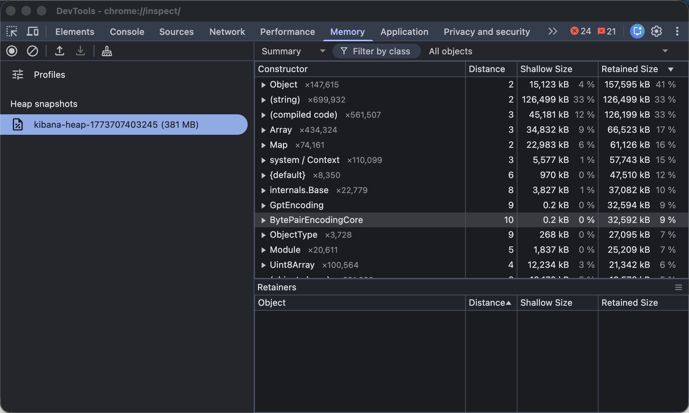

# Kibana Node.js Heap Analysis Lab

Local Docker lab for capturing and analyzing Kibana's Node.js heap memory — the equivalent of Java heap dump analysis for Kibana.

## Background

Kibana runs on Node.js (V8 engine). When investigating high memory usage or Task Manager degradation, there is no built-in per-task memory metric. This lab demonstrates how to capture a V8 heap snapshot from a live Kibana process for object-level memory analysis — similar to `jmap -dump` + Eclipse MAT in the Java world.

## Stack

| Container | Image | Port |
|-----------|-------|------|
| `es-lab` | elasticsearch:8.17.0 | 9200 |
| `kibana-lab` | kibana:8.17.0 | 5601, 9230 |
| `snapshot-helper` | node:20-alpine (local build) | 3001 |

Kibana starts with `NODE_OPTIONS=--inspect=0.0.0.0:9230` which enables the V8 inspector — the Node.js equivalent of `-agentlib:jdwp` in Java.

The `snapshot-helper` service connects to Kibana's inspector via the **Chrome DevTools Protocol (CDP)** over WebSocket and triggers `HeapProfiler.takeHeapSnapshot` programmatically — no browser required.

## Quick Start

```bash
# Start all containers
./lab.sh start

# Wait for Kibana to be ready, then take a heap snapshot
./lab.sh snapshot

# List and download the snapshot file
./lab.sh list-snapshots
./lab.sh download kibana-heap-<timestamp>.heapsnapshot
```

## All Commands

```
./lab.sh start               Start ES + Kibana + snapshot-helper
./lab.sh stop                Stop and remove all containers + volumes
./lab.sh status              ES cluster health + Kibana status
./lab.sh task-health         Kibana Task Manager health API
./lab.sh snapshot            Capture heap snapshot (CLI, no Chrome needed)
./lab.sh list-snapshots      List captured snapshots
./lab.sh download <file>     Download snapshot for Chrome DevTools analysis
./lab.sh watch-tasks         Poll Task Manager health every 5 seconds
./lab.sh logs [container]    Tail container logs
```

## Snapshot API (snapshot-helper)

The snapshot-helper exposes a REST API at `http://localhost:3001`:

```bash
POST /snapshot              # Capture heap snapshot from Kibana
GET  /snapshots             # List saved snapshots
GET  /snapshot/:file        # Download a snapshot file
GET  /targets               # List Node.js inspector targets
```

## Two Ways to Analyze

### 1. CLI (automated)

```bash
./lab.sh snapshot
./lab.sh download kibana-heap-<timestamp>.heapsnapshot
# Open Chrome DevTools (F12) → Memory tab → Load profile → select the file
```

### 2. Live Chrome DevTools (interactive)

1. Get the DevTools URL:
   ```bash
   curl -s http://localhost:9230/json | python3 -c "import json,sys; t=json.load(sys.stdin)[0]; print(t['devtoolsFrontendUrl'])"
   ```
2. Paste the `devtools://...` URL into Chrome's address bar
3. Go to **Memory** tab → select profiling type → click the record button

**Profiling types:**

| Type | Description | Java equivalent |
|------|-------------|-----------------|
| Heap snapshot | Point-in-time object inventory | `jmap -dump` + MAT |
| Allocations on timeline | Record allocations over time, isolate leaks | Java Flight Recorder |
| Allocation sampling | Low-overhead continuous profiling | Async Profiler |

## Analyzing a Heap Snapshot



Once loaded in Chrome DevTools Memory tab:

1. Set view to **Summary** and sort by **Retained Size** descending
2. Look for large `Buffer`, `Array`, or custom Kibana objects
3. Click an object → **Retainers** panel shows the reference chain keeping it alive
4. Use the filter box to search by constructor name (e.g. `TaskRunner`, `SavedObject`, `ElasticsearchClient`)

**Retained Size** is the key metric — it shows how much memory would be freed if that object were garbage collected (equivalent to Java's retained heap in MAT).

## Relation to Ticket

Kibana does not expose per-task memory metrics. This lab demonstrates the practical debugging path:

1. Check Task Manager health: `./lab.sh task-health`
2. If memory is high, capture a heap snapshot: `./lab.sh snapshot`
3. Analyze retained objects in Chrome DevTools to identify what is consuming memory
4. Correlate large objects with task types (e.g. `alerting:run`, `reporting:generate`)

## Files

```
.
├── docker-compose.yml          # ES + Kibana + snapshot-helper
├── lab.sh                      # Helper CLI
└── snapshot-helper/
    ├── Dockerfile
    ├── package.json
    ├── cdp.js                  # CDP WebSocket client
    └── server.js               # HTTP API wrapping cdp.js
```
